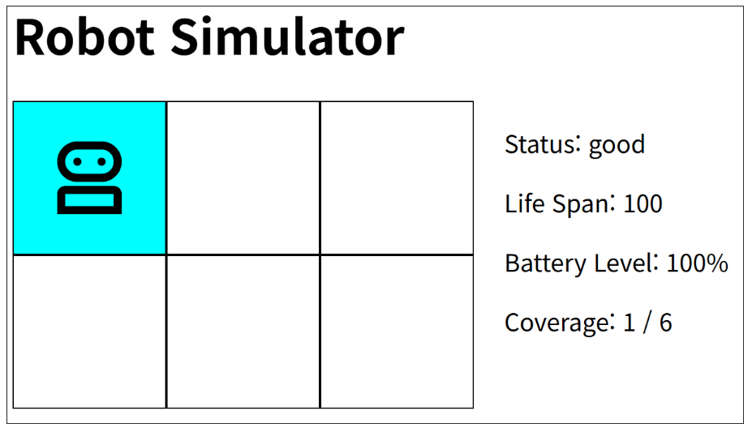

<!-- 명세서 작성 방법 
1. 요구사항이 컴팩트하게 두괄식으로 작성되어야 함 
2. 에이전트에게 직접 입력한다고 생각해야함
=> 토큰 낭비를 막아야 하기 때문에 이미지는 최소한으로 사용할 것

 -->

# 로봇 시뮬레이터

## 로봇의 목표
- 모든 면적의 순회

## Status
1. **good**: 
  - Status Display Text는 검은색; 조작 가능 
2. **broken**: 고장
  - Life Span이 0에 도달한 경우
  - Status Display Text는 빨간색; 조작 불가
3. **low battery**: 낮은 배터리
  - 배터리가 0%에 도달한 경우
  - Status Display Text는 노란색; 조작 불가
4. **finished**: 작업 완료
  - Coverage가 (row*col) / (row*col) 
  - Status Display Text는 초록색; 조작 가능

## Display
- Status
- Life Span
- Battery Level
- Coverage: 로봇이 방문한 블럭 수. 방문한 곳은 하늘색으로 색칠한다.
- Map: (row x col) 크기의 직사각형으로 각 셀은 정사각형 모양이다. 현재 위치에 로봇의 이미지가 띄워져 있다.

## Life Span
- 로봇의 내구도. 벽에 부딪치면 -10
- Life Span이 0에 도달하는 경우
  1. Robot Broken! 알림을 발생시킨다.
  2. Status: Broken 으로 변경한다.
  3. 로봇은 Status: Broken 에서 움직이지 않는다

## Battery Level
- 로봇의 배터리는 움직일 때마다 -5% 

## 로봇의 시뮬레이션 방식
1. 먼저 row, col 의 입력을 html input 태그로 받는다.
   1. 단, 입력 범위는 1 이상, 5 이하여야 한다.
2. ( row x col ) map을 생성한다.
3. 로봇의 초기 상태는 다음과 같다.
   1. Status: good
   2. Life Span: 100
   3. Battery Level: 100%
   4. Coverage: 1 / (row * col)
      1. 아직 도달하지 않은 영역이라면 1씩 증가
   5. index: (0, 0)
4. 로봇은 상하좌우, WASD 키를 통해서 조작한다.
5. 벽에 부딪히는 경우
   1. Life Span -= 10
   2. Battery Level -= 5%
   3. 배경색이 빨간색으로 잠시 변한 뒤, 다시 (디폴트 색깔인) 하늘색으로 돌아온다

## 로봇의 디스플레이 방식
1. 먼저 HTML Container 클래스 블럭 내부에 디스플레이 된다.
2. h1 태그로 "Robot Simulator"를 제목으로 놓는다.
3. h1 하단 좌측에 (row x col) 맵을 놓는다
